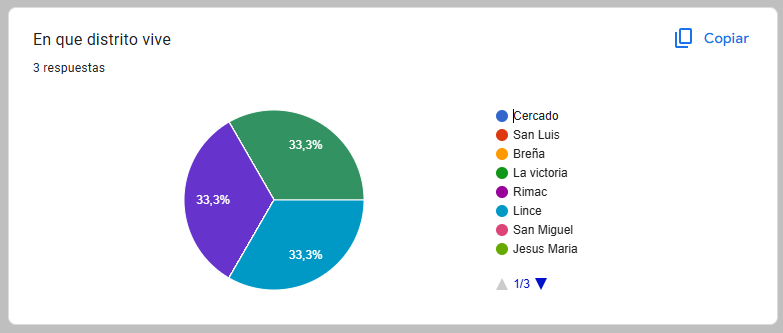
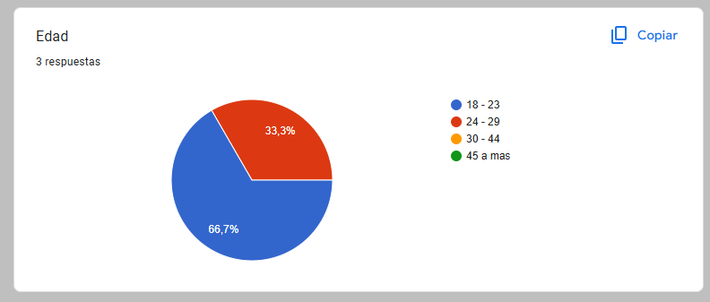
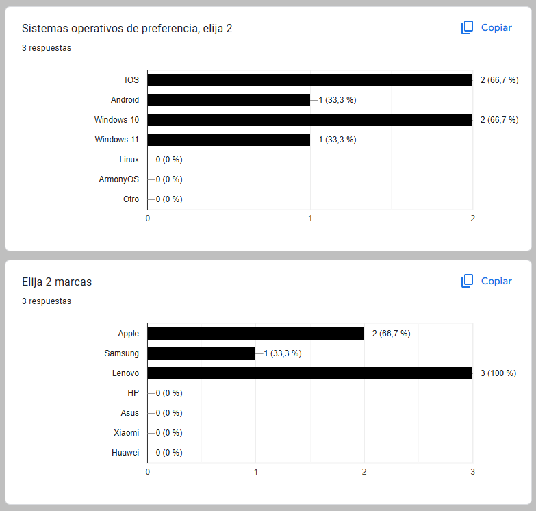
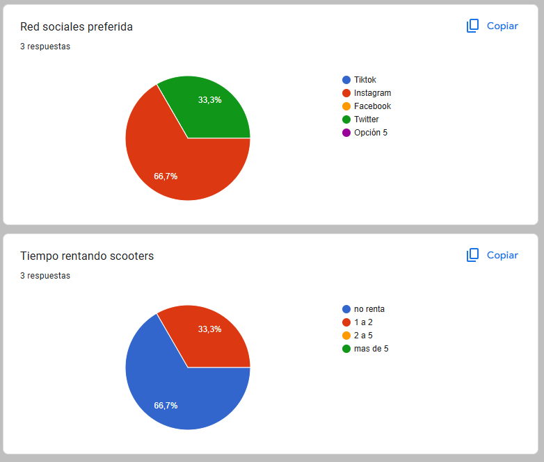
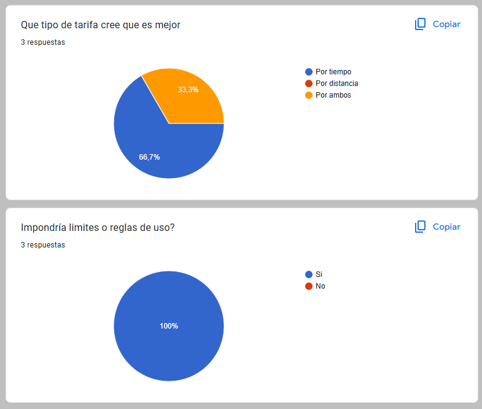
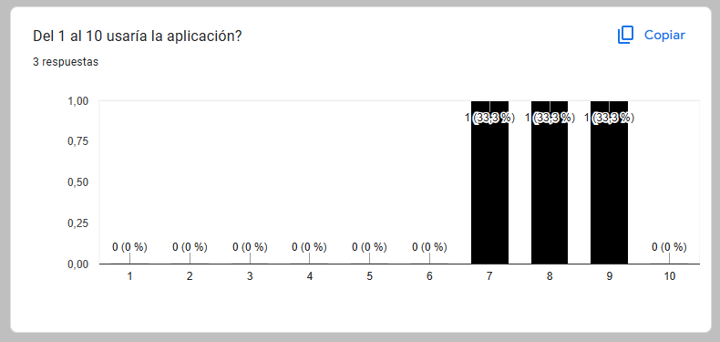
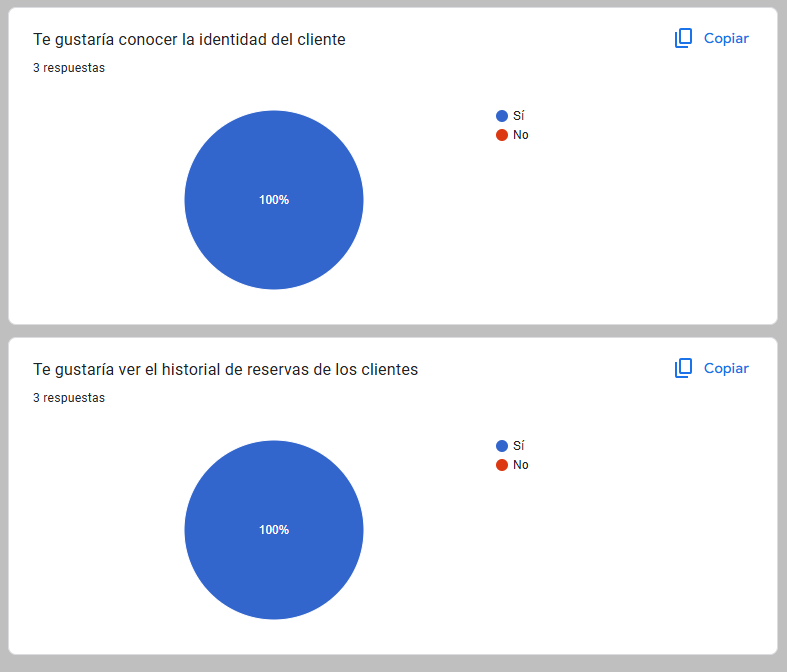

# Capítulo II: Requirements Elicitation & Analysis
## 2.1. Competidores.

### 2.1.1. Análisis competitivo

<table border="1px" style="text-align: center; width: 100%;">
  <tr>
    <th colspan="6" valign="top">Competitive Analysis Landscape</th>
  </tr>
  <tr>
    <td colspan="2" valign="top">¿Por qué llevar a cabo este análisis?</td>
    <td colspan="4" valign="top">El objetivo de este análisis es identificar las características de los competidores y encontrar maneras de diferenciarnos.</td>
  </tr>
  <tr>
    <td colspan="2" rowspan="2" valign="top">Startup y Competidores</td>
    <td valign="top">MoviRent</td>
    <td valign="top">City Bike</td>
    <td valign="top">Grin</td>
    <td valign="top">Emove</td>
  </tr>
  <tr>
    <td valign="top"></td>
    <td valign="top"></td>
    <td valign="top"></td>
    <td valign="top"></td>
  </tr>
  <tr>
    <td rowspan="2" valign="top">Perfil</td>
    <td valign="top">Overview</td>
    <td valign="top">Servicio de alquiler de scooters para la ciudad de Lima metropolitana.</td>
    <td valign="top">Servicio de alquiler de bicicletas en Miraflores, Lima.</td>
    <td valign="top">Servicio de alquiler de scooters para Lima metropolitana.</td>
    <td valign="top">Servicio de alquiler de vehículos, servicios de reparaciones, venta de equipos y accesorios.</td>
  </tr>
  <tr>
    <td valign="top">Ventaja competitiva ¿Qué valor ofrece a los clientes?</td>
    <td valign="top">Una plataforma que permite poner en alquiler scooters, ganar dinero con ello. Asimismo, se puede rentar mediante suscripcion</td>
    <td valign="top">La forma de alquiler es mediante registros por plataforma web o móvil, la suscripción está disponible desde pase diario, mensual y anual.</td>
    <td valign="top">Permite a los usuarios alquilar mediante suscripción sus scooters. Además, ofrece mantenimiento gratuito.</td>
    <td valign="top">Permite a los usuarios el alquiler de vehículos, la compra y venta de accesorios nuevos como de segunda mano, a través de su sitio web.</td>
  </tr>   
  <tr>
    <td rowspan="2" valign="top">Perfil de Marketing</td>
    <td valign="top">Mercado objetivo</td>
    <td valign="top">Personas de entre 18 y 65 años que requieren movilizarse por la ciudad de Lima y personas de entre 18 y 65 para el alquiler.</td>
    <td valign="top">Personas mayores a 18 años, para habitantes de Lima, visitantes y turistas.</td>
    <td valign="top">Personas mayores de 15 años que se deben movilizar por Lima Metropolitana diariamente.</td>
    <td valign="top">Personas mayores de 18 años que busquen promover los vehículos de micromovilidad.</td>
  </tr>
  <tr>
    <td valign="top">Estrategias de marketing</td>
    <td valign="top">Publicidad por redes sociales y vallas publicitarias en calles de mayor afluencia.</td>
    <td valign="top">Publicidad en redes sociales.</td>
    <td valign="top">Publicidad en redes sociales y afiches.</td>
    <td valign="top">Publicidad en redes sociales.</td>
  </tr>
  <tr>
    <td rowspan="3" valign="top">Perfil de Producto</td>
    <td valign="top">Productos & Servicios</td>
    <td valign="top">Alquilerde scooters.</td>
    <td valign="top">Alquiler de bicicletas.</td>
    <td valign="top">Alquiler de scooters y mantenimiento.</td>
    <td valign="top">Alquiler de vehículos y servicio de reparaciones.</td>
  </tr>
  <tr>
    <td valign="top">Precios & Costos</td>
    <td valign="top">
      Planes de suscripción: 
      - Plan mensual: s/. 39 
      - Plan trimestral: s/. 99 
      - Plan anual: s/. 199 
    </td>
    <td valign="top">
      Planes de suscripción:  
      - Diario: s/4.33    
      - Mensual: s/19.50  
      - Anual: s/151.73 
    </td>
    <td valign="top">
      Planes de suscripción: 
      - Mensual: S/. 139 
      - Bimestral: S/. 239 
      - Trimestral: S/. 329 
    </td>
    <td valign="top">
      Costo de alquiler: 
      - 2 horas: s/. 60 
      - 4 horas: s/. 80 
      - 1 día: s/. 120 
    </td>
  </tr>
  <tr>
    <td valign="top">Canales de distribución (Web y/o Móvil)</td>
    <td valign="top">Principalmente a través de su sitio web oficial.</td>
    <td valign="top">Principalmente a través de su sitio web, con posibilidad de acceso móvil.</td>
    <td valign="top">Principalmente a través de su sitio web oficial.</td>
    <td valign="top">Principalmente a través de su sitio web oficial.</td>
  </tr>
  <tr>
    <td rowspan="4" valign="top">Análisis SWOT</td>
    <td valign="top">Fortalezas</td>
    <td valign="top">
      Modelo de negocio innovador que combina alquiler por suscripción y oportunidad para propietarios de generar ingresos adicionales.
    </td>
    <td valign="top">
      Posibilidad para personas que optan por un transporte eficiente y sano.
    </td>
    <td valign="top">
      Base de clientes establecida, está presente en lugares con mayor afluencia de tráfico.
    </td>
    <td valign="top">
      - Variedad de servicios 
      - Movilidad sostenible 
      - Flexibilidad de precios 
    </td>
  </tr>
  <tr>
    <td valign="top">Debilidades</td>
    <td valign="top">
      Dependencia de la disponibilidad de los vehículos por parte de los propietarios. 
      No contamos con un sistema de rastreo sofisticado.
    </td>
    <td valign="top">
      No cuenta con servicio de mantenimiento.
    </td>
    <td valign="top">
      No cuenta con aplicación móvil, costos elevados. Poca publicidad.
    </td>
    <td valign="top">
      - Dependencia tecnológica 
      - Competencia 
      - Costos de mantenimiento 
      - Dependencia climática 
    </td>
  </tr>
  <tr>
    <td valign="top">Oportunidades</td>
    <td valign="top">
      Es innovador y no afecta al medio ambiente. Asimismo, tiene un impacto positivo en la economía y salud de los usuarios.
    </td>
    <td valign="top">
      La ciudad de Miraflores cuenta con vías exclusivas para bicicletas y posibilidad para expandir a más distritos Limeños.
    </td>
    <td valign="top">
      Expandir su base de usuarios ya sea con mayor publicidad o más alcance a zonas de cobertura del servicio.
    </td>
    <td valign="top">
      - Expansión de mercado 
      - Alianzas estratégicas 
      - Diversificación de servicios 
      - Tendencia de movilidad urbana 
    </td>
  </tr>
  <tr>
    <td valign="top">Amenazas</td>
    <td valign="top">
      Creciente aumento de competidores en el mercado de alquiler de scooters.
    </td>
    <td valign="top">
      Las invasiones de motorizados a ciclovías y los robos de equipos (bicicletas) en lugares con poca seguridad.
    </td>
    <td valign="top">
      Cambios en la regulación del transporte.
    </td>
    <td valign="top">
      Cambios en la regulación, críticas negativas y avances tecnológicos representan amenazas potenciales para la operación y la reputación de Samma en el mercado.
    </td>
  </tr>
</table>

### 2.1.2. Estrategias y tácticas frente a competidores

Teniendo en cuenta el analisis SWOT se propone las siguientes estrategias competitivas:

#### Estrategias competitivas para MoviRent:

1. Liderazgo en costos:

Podemos buscar optimizar los procesos que permitan reducir los gastos de infraestructura y ofrecer los servicios a precios mas competitivos que los competidores.

2. Diferenciación:

MoviRent puede enfocarse en desarrollar caracteristicas y funcionalidades unicas que destaquen en su plataforma como lider en innovacion.

3. Enfoque en segmentos especificos del mercado:

MoviRent puede enfocarse en segmentos especificos del mercado donde pueda ofrecer un valor diferenciado y adaptado.
Aprovecha la oportunidad de expandir nuestro servicio a otras áreas metropolitanas y turísticas, más allá de la ubicación actual de nuestros competidores. Esto nos permitirá alcanzar a una base de usuarios más amplia y capturar nuevos mercados.

#### Tácticas específicas para MoviRent:

1. Estrategia de precios

Ajustar estrategicamente los precios de suscripción para competir de manera efectiva en el mercado

2. Inversion en marketing diferenciado

Desarrollar mensajes y campañas de marketing que resalten las fortalezas unicas y la propuesta de valor de MoviRent.

## 2.2. Entrevistas

### 2.2.1. Diseño de entrevistas

#### Entrevistas segmento 01: Owner
1. ¿Cual es tu nombre completo?
2. ¿Cuántos años tienes? ¿En que distrito resides actualmente?
3. ¿En que sector se desempeña laboralmente? ¿Que funciones realizas?
4. ¿Para trabajar que dispositivo se le hace mas comodo? ¿Que marca es?
5. ¿Que navegador web prefiere utilizar en su dia a dia y por qué?
6. ¿Que medios informativos usa con mayor frecuencia? ¿Y de entretenimiento?
7. ¿Hace cuantos años te dedicas a rentas sus vehiculos?
8. ¿Que estrategia de marketing haces a las personas nuevas para que te alquilen tu vehiculo?
9. ¿Como manejas las tarifas para tus vehiculos?
10. ¿Cómo te gustaría que sean las tarifas de alquiler?
11. ¿Manejas algún limite o reglas para las personas que te alquilan?
12. ¿Como te contactas con tus clientes o personas quienes te alquilan?
13. ¿Que haces cuando tu vehiculo se malogra?
14. ¿Tienes un límite de tiempo o distancia para el alquiler?
15. ¿Usualmente, que equipos electrónicos usas con mayor frecuencia?
16. Según nuestro proyecto mensionado, ¿Que te parece la idea?
17. ¿Usarías nuestra aplicación web?
18. ¿Qué te parecería poder visualizar la identidad del cliente?
19. ¿Qué te parecería poder visualizar el historial de rentas del cliente?
20. ¿Qué medidas de seguridad deben tener en cuenta los usuarios al usar los vehículos?
21. ¿Cuentas con algún tipo de seguro?
22. ¿Te gustaría que ofrezcamos algún tipo de seguro?
23. ¿Dónde te gustaría entregar tus vehículos?
24. ¿Cuáles son tus expectativas en cuanto a la cantidad de reservas a través de la aplicación?
25. ¿Con qué frecuencia te gustaría alquilar tus vehículos?
26. ¿Hay alguna mejora o característica adicional que te gustaría ver en la aplicación en el futuro?

#### Entrevistas segmento 2: Client
1. ¿Cual es tu nombre? ¿Cuántos años tienes? ¿Dónde vives actualmente? ¿A qué te dedicas?
2. ¿Qué dispositivos de escritorio usas mayormente? ¿Y de móvil? ¿Por que? ¿Que marca es?
3. ¿Que navegador web prefiere utilizar en su dia a dia y por qué?
4. ¿Que medios informativos usa con mayor frecuencia? ¿Y de entretenimiento?
5. ¿Qué medios de transporte utilizas con mayor frecuencia?
6. ¿Cuánto tiempo dedicas a desplazarte en el transporte diariamente?¿Qué tipo de transporte es?
7. ¿Cuáles son los mayores desafíos que enfrentas con tu transporte actual?
8. ¿Cuánto dinero aproximadamente gasta al mes en transporte convencional?¿Qué tan satisfecho estás con el servicio que este te ofrece?
9. ¿Qué te parecería contar con un servicio de vehículos alternativos como las bicicletas o scooters?
10. ¿Qué tipo de vehículos preferirías alquilar (bicicletas, scooters, patinetas eléctricas, etc.)?
11. ¿Qué aspectos consideras más importantes al elegir un servicio de alquiler de vehículos?
12. ¿Estarías dispuesto(a) a pagar una suscripción mensual por este servicio?
13. ¿Qué te parece la idea de incluir el mantenimiento del vehículo en la suscripción?
14. ¿Crees que este servicio podría ayudarte a reducir tus costos mensuales de transporte y el tiempo perdido en el tráfico?
15. ¿Con qué frecuencia crees que utilizarías este servicio de alquiler de vehículos?
16. ¿Qué tan importante es para ti la disponibilidad de vehículos en distintos puntos de la ciudad?
17. ¿Hay alguna mejora o característica adicional que te gustaría ver en la aplicación en el futuro?

 

### 2.2.2 Registro de entrevistas.

En esta sección se presentan las entrevistas realizadas a los segmentos objetivo.

### Entrevistas segmento 1: Owners
#### Entrevista 1:

Datos del entrevistador:
* Nombres: Quique Vladimir
* Apellidos: Jara Benites

Datos del entrevistado:
* Nombres: David
* Apellidos: Beltran Burgos
* Edad: 23
* Distrito de residencia: San Borja
* Enlace a la entrevista: [Ver Video](https://upcedupe-my.sharepoint.com/:v:/g/personal/u202022365_upc_edu_pe/EZSdPhz59ytBr7yjIHvAProBDVrmA4ru6q7oZv2RxS74Ww?e=a118uE&nav=eyJyZWZlcnJhbEluZm8iOnsicmVmZXJyYWxBcHAiOiJTdHJlYW1XZWJBcHAiLCJyZWZlcnJhbFZpZXciOiJTaGFyZURpYWxvZy1MaW5rIiwicmVmZXJyYWxBcHBQbGF0Zm9ybSI6IldlYiIsInJlZmVycmFsTW9kZSI6InZpZXcifX0%3D)
* Duración de la entrevista: 5:51

**Informe del resumen de la entrevista:**
David Beltrán un joven de 23 años, residente de San Borja. Actualmente trabaja en el sector
financiero, sus funciones las cumple en el departamento de cobranzas del BCP. Sus sitemas
operativos de preferencia son IOS en moviles y windows en ordenadores. El navegador que usa
con mayor frecuencia es chrome. Tiene preferencia por la marca Apple y lenovo. Su canal
informativo favorito es Twitter y de entretenimiento instagram. Beltrán posee un scooter
eléctrico como vehiculo personal y no tiene experiencia previa en el alquiler de vehiculos.
Considera que las tarifas de alquiler deberían depender del tiempo de uso de cada equipo y
prefiere los pagos a través de transferencias bancarias o aplicativos móviles como YAPE o Plin.
Sugiere que el límite de tiempo o distancia para el alquiler debería restringirse solo a Lima.
En caso de daños durante el uso del vehículo, espera una compensación por parte de la empresa.
Valora la posibilidad de visualizar la identidad y el historial de rentas de los clientes.
Recomienda medidas de seguridad como el uso de casco y respetar las normas de tránsito.
Prefiere entregar los vehículos en módulos con supervisión. Inicialmente, espera pocas reservas, pero prevé un aumento
con el tiempo. La entrevista concluyó con la posibilidad de requerir feedback en el futuro y
agradecimientos mutuos.

#### Entrevista 2:

Datos del entrevistador:
* Nombres: Néstor H.
* Apellidos: Velarde Gonzales

Datos del entrevistado:
* Nombres: Sebastian
* Apellidos: Flores Mendez.
* Edad: 25
* Distrito de residencia: Villa Maria del Triunfo.
* Enlace a la entrevista: [Ver Video](https://upcedupe-my.sharepoint.com/:v:/g/personal/u20211c221_upc_edu_pe/EcJxI89tEyVKqjwAXpUzEfQBPCIByK7wqXOgZCX6WY3K_g?e=PHNrCW)
* Duración de la entrevista: 5:55

**Informe del resumen de la entrevista:**

Sebastián Flores, un joven de 25 años, residente de Villa María del Triunfo. Actualmente trabaja
en una empresa de logística, desempeñando funciones de sistemas y soporte técnico. El usa dispositivos
como Android y Windows, y prefiere el navegador Chrome. Su marca preferida es Samsung y Lenovo.
Los fines de semana le gusta salir de paseo a los parques con su familia en scooter, a veces de
caminata por el distrito, siempre a poseido desde muchos años mas de un Scooter electrico en su casa,
de hecho el a veces alquila su scooter a sus amigos o conocidos, pero nunca a tenenido la experiencia
de alquilar mediante aplicaciones web o plataformas que ofrezcan este serviccio, el considera que las
el alquiler es una oportunidad por que le permite ganar dinero extra, y le gustaria que las tarifas
de alquiler sean flexibles y dependan del tiempo de uso, esta tambien a el le permite recuperar lo
invertido en su scooter, basado en nuestro proyecto, le parece una idea interesante, y estaria dispuesto
a usar nuestra aplicacion web, le gustaria visualizar las operaciones necesarias para el alquiler.

### Entrevistas segmento 2: Clientes
#### Entrevista 1:

Datos del entrevistador:
* Nombres: Mathias Adriano
* Apellidos: Hidalgo Lopez

Datos del entrevistado:
* Nombres: Brissa Arakemi
* Apellidos: Hoyos Arevalo
* Edad: 19
* Distrito de residencia: Rimac
* Enlace a la entrevista: [Ver Video](https://upcedupe-my.sharepoint.com/:v:/g/personal/u202213222_upc_edu_pe/EYvfM5T1ScdBpoM4ZDAvlQgBLmbxD7DTIk_2O02DixCJBw?e=RxA0RV)
* Duración de la entrevista: 6:05

**Informe del resumen de la entrevista:**
Brisa, una joven de 19 años, residente en Rímac, estudiante de Administración de Empresas. Utiliza
principalmente una laptop y un iPhone como dispositivos personales. Su navegador web preferido es Safari,
ya que es el que viene con su celular. Para informarse, usa Instagram, y para entretenimiento, Prime
Video. Su medio de transporte más utilizado es el carro, dedicando aproximadamente 2 horas diarias a
desplazarse. Sus principales preocupaciones con el transporte actual son la inseguridad y no llegar a
tiempo. Gasta alrededor de 50 a 60 soles mensuales en transporte convencional, y se siente insatisfecha
con el servicio que recibe.

Brisa considera una buena opción contar con servicios de vehículos alternativos. Los aspectos más
importantes para ella al elegir un servicio de alquiler de vehículos son la accesibilidad, la disponibilidad cercana, la facilidad de comunicación con el propietario, la opción de pagar con tarjeta, y que el vehículo esté en buen estado. Estaría dispuesta a pagar una suscripción mensual por este servicio.

Cree que este servicio podría ayudarla a reducir su tiempo en el tráfico, aunque no lo ve como una opción
más económica. Espera usar el servicio con mucha frecuencia y considera muy importante la disponibilidad
de vehículos en distintos puntos de la ciudad. Le gustaría que la aplicación proporcionara información
detallada sobre el estado del vehículo, su historial, mantenimiento, y características específicas. La
entrevista concluyó con agradecimientos mutuos y despedida.

### Entrevista 2:

Datos del entrevistador:
* Nombres: Roy Linsh
* Apellidos: Fernández Remón

Datos del entrevistado:
* Nombres: Maryori
* Apellidos: Atanacio Cruces
* Edad: 23
* Distrito de residencia: San Juan de Lurigancho
* Enlace a la entrevista: [Ver Video](https://upcedupe-my.sharepoint.com/:v:/g/personal/u20221b778_upc_edu_pe/ESrNi2J7CPxCmG1crP6I85gBDxv_9VtZJzbnSfIrn9WDqA?e=5e70nZ)
* Duración de la entrevista: 7:58

**Informe del resumen de la entrevista:**
Maryori Atanacio Cruces, una joven de 23 años, residente de San Juan de Lurigancho. Actualmente es
estudiante. Utiliza una computadora de escritorio y un dispositivo móvil Xiaomi. Su navegador web
preferido es Google Chrome debido a su familiaridad con el método de búsqueda. 
Maryori usa con mayor frecuencia Facebook como medio informativo y de 
entretenimiento. Se desplaza mayormente en bus, dedicando alrededor de 2 horas y media diarias para 
llegar a la universidad, gastando un aproximado de 100 soles al mes en transporte.

Considera positivo contar con un servicio de vehículos alternativos como bicicletas o scooters, y
menciona que es fan de lo eléctrico, prefiriendo vehículos cómodos como su patineta eléctrica. Está dispuesta a pagar una suscripción mensual. Cree que este servicio podría ayudarla a
reducir costos y tiempo en el tráfico, y lo usaría diariamente para ir a la universidad. La
disponibilidad de vehículos en distintos puntos de la ciudad es importante para ella, sugiriendo además
que la aplicación podría facilitar el pago mediante YAPE y ofrecer promociones a través de esa plataforma.

La entrevista concluyó con la posibilidad de mejoras en la aplicación y agradecimientos mutuos.

#### Entrevista 3:

Datos del entrevistador:
* Nombres: Adriana Maria
* Apellidos: Diestra Zambrano

Datos del entrevistado:
* Nombres: Jeremy
* Apellidos: Escudero Garcia
* Edad: 19
* Distrito de residencia: Rímac
* Enlace a la entrevista: [Ver Video](---)
* Duración de la entrevista: 4:41

**Informe del resumen de la entrevista:**

Jeremy Escudero un joven de 19 años, residente del distrito del Rímac. Actualmente trabaja y estudia. Estudia en la Universidad Nacional Federico Villarreal en la carrera de contabilidad. El navegador que usa con mayor frecuencia es google. Su canal informativo son los noticieros y de entretenimiento los videojuegos. Jeremy es un joven que desea alquilar un scooter para llegar a sus destinos de manera rápida. Considera que las tarifas de los buses es accesible pero se le hace incomodo por la cantidad de gente. Le gustaria alquilar un scooter que sea menor presupuesto de lo que gasta al mes en los buses.

### Entrevista 4:

Datos del entrevistador:
* Nombres: Roy Linsh
* Apellidos: Fernández Remón

Datos del entrevistado:
* Nombres: Jefrey
* Apellidos: Prado
* Edad: 23
* Distrito de residencia: San Juan de Lurigancho
* Enlace a la entrevista: [Ver Video](https://upcedupe-my.sharepoint.com/:v:/g/personal/u20221b778_upc_edu_pe/ESYHQW3mA-hDq81S5Vbto-ABpfXj_7VY_dmt5rjmBeJ-Rw?e=YpnHj6&nav=eyJyZWZlcnJhbEluZm8iOnsicmVmZXJyYWxBcHAiOiJTdHJlYW1XZWJBcHAiLCJyZWZlcnJhbFZpZXciOiJTaGFyZURpYWxvZy1MaW5rIiwicmVmZXJyYWxBcHBQbGF0Zm9ybSI6IldlYiIsInJlZmVycmFsTW9kZSI6InZpZXcifX0%3D)
* Duración de la entrevista: 7:21

**Informe del resumen de la entrevista:**
Jefrey Prado, es un joven de 23 años, residente de San Juan de Lurigancho. Actualmente es
estudiante de la carrera de Arquitectura. Utiliza una laptop y un dispositivo móvil marca ZTE. Su navegador web
preferido es Google Chrome debido a que se me hace muy cómodo y rápido.
Jefrey usa con mayor frecuencia Facebook e Instagram como medios informativos y de
entretenimiento. Se desplaza en bus, tren y taxi aunque mayormente en bus, dedicando alrededor de 4 a 5 horas diarias para
llegar a la universidad, gastando un aproximado de 600 soles al mes en transporte.

Considera que es una buena idea contar con un servicio de vehículos alternativos como bicicletas o scooters pero menciona que se transporta en zonas un tanto peligrosas, por la cual, lo pensaría un poco sobre en que zonas podría utilizar su vehículo.
También menciona que los aspectos más importantes para él sobre el alquiler de vehículos alternativos sería la calidad de los mismos, la velocidad que le puedan brindar y los precios del alquiler.

La entrevista concluyó con la posibilidad de poder añadir más planes de suscripción que sean para todos los bolsillos y agradecimientos mutuos.

### 2.2.3 Análisis de entrevistas.

**Segmento 1: Owner**

Dado que la mayoría de los entrevistados viven en áreas céntricas de Lima, hay una demanda potencial en estas zonas, donde la infraestructura y el tránsito pueden favorecer el uso de scooters como alternativa de transporte.  

  

Con un 66.7% de usuarios en el rango de 18-23 años, el negocio debe enfocarse en estrategias de marketing dirigidas a un público joven, que está más abierto a adoptar nuevas tecnologías y servicios de movilidad. Asimismo como trabajan en el sector de negocios, es probable que estos usuarios busquen formas de rentabilizar sus activos, como scooters, de manera eficiente. Esto sugiere que un enfoque en la facilidad de gestión y en la maximización de ingresos podría atraer a estos profesionales a usar la plataforma para rentar sus vehículos a otros.  

  

La preferencia por iOS y Windows 10 entre el 66.7% de los encuestados indica que la aplicación de alquiler de scooters debe ser optimizada para estos sistemas operativos para mejorar la experiencia del usuario. Asimismo, Con el 66.7% prefiriendo Apple y el 100% Lenovo, es importante que el diseño y la calidad del servicio reflejen los altos estándares asociados con estas marcas, para alinearse con las expectativas de los usuarios.  

Dado que el 66% prefiere Instagram, esta plataforma debería ser un canal clave para la promoción del servicio de alquiler de scooters. Por otro lado, con un 66.7% que no ha rentado scooters previamente, existe un mercado significativo de potenciales nuevos usuarios que podrían beneficiarse de promociones iniciales.  

El 66% de los encuestados prefiere una tarifa basada en el tiempo de uso, lo que sugiere que este modelo de negocio podría ser más atractivo. Tambien, con el 100% de los usuarios queriendo reglas de uso claras, es crucial establecer normas y condiciones estrictas para garantizar la seguridad y la confianza.  

El hecho de que el 100% de los encuestados calificaran su interés en usar la aplicación con un 7 o más indica una alta disposición a adoptar el servicio.  

Finalmente la preferencia del 100% por ver la identidad y el historial de reservas de otros usuarios subraya la importancia de integrar funciones de transparencia y confianza en la aplicación para aumentar la seguridad percibida y la satisfacción del usuario.  

**Segmento 2: Cliente**

De las entrevistas realizadas se obtuvo que el 100% de los participantes gasta más de 100 soles  mensuales en transporte público. Asimismo, mencionaron que sus mayores desafíos durante sus viajes son los tiempos largos que toma la congestión vehicular en la ciudad. El 100% muestra cierto interés en un servicio de alquiler de vehículos menores y el 66.66% estaría dispuesto a pagar por el servicio.

## 2.3. Needfinding

En esta sección analizamos la información recopilada en las entrevistas realizadas a nuestros segmentos objetivos.

### 2.3.1. User Personas

Los user persona que se muestran a continuación, fueron realizados a partir de la información recopilada de la sección de entrevistas.
Estos nos ayudarán a describir de forma general nuestro segmento objetivo.

**Segmento 1 - Owner:**

**Segmento 2 - Client:**

### 2.3.2. User Task Matrix

Para lograr sus objetivos en la plataforma, este User Task Matrix muestra las tareas que realizan los User Persona de dos segmentos objetivos: el Owner (que publica y gestiona scooters para alquiler o venta) y el User (que busca alquilar o comprar un scooter). Es importante destacar que estas tareas son actividades que los usuarios deben realizar independientemente de si existe una solución digital para facilitarlas; no deben confundirse con funcionalidades de software.

<table border="1px">
    <thead>
        <tr>
            <th>Tarea / Funcionalidad</th>
            <th>Owner - Frecuencia</th>
            <th>Owner - Importancia</th>
            <th>User - Frecuencia</th>
            <th>User - Importancia</th>
        </tr>
    </thead>
    <tbody>
        <tr>
            <td><strong>Publicar scooter</strong></td>
            <td>Media</td>
            <td>Alta</td>
            <td>N/A</td>
            <td>N/A</td>
        </tr>
        <tr>
            <td><strong>Editar detalles del scooter</strong></td>
            <td>Media</td>
            <td>Alta</td>
            <td>N/A</td>
            <td>N/A</td>
        </tr>
        <tr>
            <td><strong>Gestión de inventario</strong></td>
            <td>Alta</td>
            <td>Alta</td>
            <td>N/A</td>
            <td>N/A</td>
        </tr>
        <tr>
            <td><strong>Historial de transacciones</strong></td>
            <td>Alta</td>
            <td>Alta</td>
            <td>Baja</td>
            <td>Media</td>
        </tr>
        <tr>
            <td><strong>Notificaciones sobre estado de scooter</strong></td>
            <td>Alta</td>
            <td>Alta</td>
            <td>Alta</td>
            <td>Alta</td>
        </tr>
        <tr>
            <td><strong>Calificaciones y reseñas de scooters y Owners</strong></td>
            <td>Media</td>
            <td>Alta</td>
            <td>Media</td>
            <td>Alta</td>
        </tr>
        <tr>
            <td><strong>Consulta de disponibilidad de scooters</strong></td>
            <td>N/A</td>
            <td>N/A</td>
            <td>Alta</td>
            <td>Alta</td>
        </tr>
        <tr>
            <td><strong>Reservar un scooter</strong></td>
            <td>N/A</td>
            <td>N/A</td>
            <td>Media</td>
            <td>Alta</td>
        </tr>
        <tr>
            <td><strong>Confirmar o rechazar reservas</strong></td>
            <td>Media</td>
            <td>Alta</td>
            <td>N/A</td>
            <td>N/A</td>
        </tr>
        <tr>
            <td><strong>Pago y facturación</strong></td>
            <td>Alta</td>
            <td>Alta</td>
            <td>Alta</td>
            <td>Alta</td>
        </tr>
        <tr>
            <td><strong>Centro de ayuda y asistencia</strong></td>
            <td>Baja</td>
            <td>Media</td>
            <td>Baja</td>
            <td>Media</td>
        </tr>
        <tr>
            <td><strong>Administración de perfil y preferencias</strong></td>
            <td>Baja</td>
            <td>Media</td>
            <td>Baja</td>
            <td>Media</td>
        </tr>
        <tr>
            <td><strong>Verificación de identidad y seguridad</strong></td>
            <td>Baja</td>
            <td>Alta</td>
            <td>Baja</td>
            <td>Alta</td>
        </tr>
    </tbody>
</table>

En base al User Task Matrix presentado, podemos destacar las siguientes tareas con mayor frecuencia e importancia para cada segmento de usuarios:

### Owner:

- Gestión de inventario: Realizada con alta frecuencia y es de alta importancia, ya que los Owners deben mantener actualizada la disponibilidad y estado de sus scooters para maximizar las oportunidades de alquiler o venta.

- Historial de transacciones: También tiene alta frecuencia e importancia porque permite a los Owners rastrear todas las actividades relacionadas con sus scooters.

- Notificaciones sobre estado de scooter: Frecuencia alta, ya que los Owners necesitan estar al tanto de cambios en el estado de sus scooters para gestionar sus inventarios eficientemente.

- Pago y facturación: Crítica para la gestión financiera y administrativa de los Owners.

### Client:

- Consulta de disponibilidad de scooters: Tarea realizada con alta frecuencia y de alta importancia, ya que los usuarios necesitan encontrar scooters disponibles rápidamente.

- Notificaciones sobre estado de scooter: Alta frecuencia y alta importancia para estar informados de cambios o confirmaciones en sus reservas.

- Pago y facturación: Fundamental para completar el proceso de alquiler o compra de scooters.

### Principales diferencias y coincidencias entre los User Personas:

**Diferencias entre los Segmentos**

- Owner se enfoca más en tareas administrativas y de gestión de scooters, como gestionar inventarios y verificar historial de transacciones, que son cruciales para mantener el negocio operativo y eficiente.

- User se centra más en tareas de búsqueda y reserva, como consultar disponibilidad de scooters y realizar reservas, reflejando su rol como consumidores del servicio.

**Coincidencias entre los Segmentos**

- Ambos segmentos consideran que las notificaciones y pago y facturación son tareas de alta importancia y frecuencia, ya que estas actividades son esenciales para la operatividad tanto desde el lado del ofertante (Owner) como del demandante (User).

- Ambos también asignan importancia a la seguridad y verificación de identidad, asegurando confianza y fiabilidad en las transacciones.

### 2.3.3. User Journey Mapping

En esta sección se presentan los User Journey Mapping de los segmentos, que realizamos con el fin de dar a entender
cómo se siente nuestro usuario al usar la aplicación, detallando cada paso que realiza y las emociones que experimenta.

**Segmento 1 - Owner:**   

**Segmento 2 - Client:**   

### 2.3.4. Empathy Mapping

En esta sección mostramos los empathy mapping de los segmentos realizados con la información recopilada de componentes anteriores.

**Segmento 1 - Owner:**

**Segmento 2 - CLient:**

### 2.3.5. As-is Scenario Mapping

En esta sección se realizaron las distintas etapas de preparación, tales como la lluvia
de ideas individual, revisión e identificación de fases como columnas,
para conseguir los As-is Scenario Mapping de los tres segmentos.
objetivos.

**Segmento 1 - Owner**  

**Segmento 2 - Client**  

 

## 2.4. Ubiquitous Language.

<table border="1">
    <thead>
        <tr>
            <th>Término (Inglés)</th>
            <th>Término (Español)</th>
            <th>Definición</th>
        </tr>
    </thead>
    <tbody>
        <tr>
            <td>Owner</td>
            <td>Propietario</td>
            <td>Persona o entidad que posee scooters y los ofrece para alquiler o venta en la plataforma.</td>
        </tr>
        <tr>
            <td>User</td>
            <td>Usuario</td>
            <td>Persona que utiliza la plataforma para alquilar o comprar scooters.</td>
        </tr>
        <tr>
            <td>Scooter</td>
            <td>Scooter</td>
            <td>Vehículo de movilidad personal de dos ruedas impulsado por electricidad, disponible para alquiler o venta.</td>
        </tr>
        <tr>
            <td>Listing</td>
            <td>Publicación</td>
            <td>Anuncio creado por un Owner para ofrecer un scooter en alquiler o venta.</td>
        </tr>
        <tr>
            <td>Booking</td>
            <td>Reserva</td>
            <td>Acción de alquilar un scooter por un periodo de tiempo específico.</td>
        </tr>
        <tr>
            <td>Transaction</td>
            <td>Transacción</td>
            <td>Proceso de intercambio monetario entre un User y un Owner por la compra o alquiler de un scooter.</td>
        </tr>
        <tr>
            <td>Inventory Management</td>
            <td>Gestión de Inventario</td>
            <td>Procesos que un Owner utiliza para administrar sus scooters disponibles en la plataforma.</td>
        </tr>
        <tr>
            <td>Rating</td>
            <td>Calificación</td>
            <td>Valoración numérica proporcionada por un User sobre un scooter o servicio.</td>
        </tr>
        <tr>
            <td>Review</td>
            <td>Reseña</td>
            <td>Comentario descriptivo proporcionado por un User acerca de su experiencia con un scooter o Owner.</td>
        </tr>
        <tr>
            <td>Availability</td>
            <td>Disponibilidad</td>
            <td>Estado de un scooter que indica si está libre para ser reservado o no.</td>
        </tr>
        <tr>
            <td>Notification</td>
            <td>Notificación</td>
            <td>Mensaje automatizado enviado para informar sobre eventos importantes en la plataforma.</td>
        </tr>
        <tr>
            <td>Cancellation Policy</td>
            <td>Política de Cancelación</td>
            <td>Reglas que definen las condiciones para cancelar una reserva y los reembolsos asociados.</td>
        </tr>
        <tr>
            <td>Customer Support</td>
            <td>Soporte al Cliente</td>
            <td>Servicio de asistencia para resolver problemas o responder preguntas de Users y Owners.</td>
        </tr>
        <tr>
            <td>Terms of Service</td>
            <td>Términos del Servicio</td>
            <td>Reglas y condiciones que rigen el uso de la plataforma y las responsabilidades de los Users y Owners.</td>
        </tr>
        <tr>
            <td>Fleet Management</td>
            <td>Gestión de Flota</td>
            <td>Administración de múltiples scooters por un Owner para optimizar su uso y rendimiento.</td>
        </tr>
        <tr>
            <td>User Profile</td>
            <td>Perfil del Usuario</td>
            <td>Información personal y preferencias de un User almacenadas en la plataforma.</td>
        </tr>
        <tr>
            <td>Trust & Safety</td>
            <td>Confianza y Seguridad</td>
            <td>Estrategias y políticas para garantizar un ambiente seguro y de confianza en la plataforma.</td>
        </tr>
        <tr>
            <td>Return Policy</td>
            <td>Política de Devolución</td>
            <td>Normas que especifican las condiciones para devolver un scooter después de la compra o alquiler.</td>
        </tr>
        <tr>
            <td>Payment Gateway</td>
            <td>Pasarela de Pago</td>
            <td>Servicio que facilita el procesamiento de pagos en línea entre Users y Owners.</td>
        </tr>
    </tbody>
</table>

